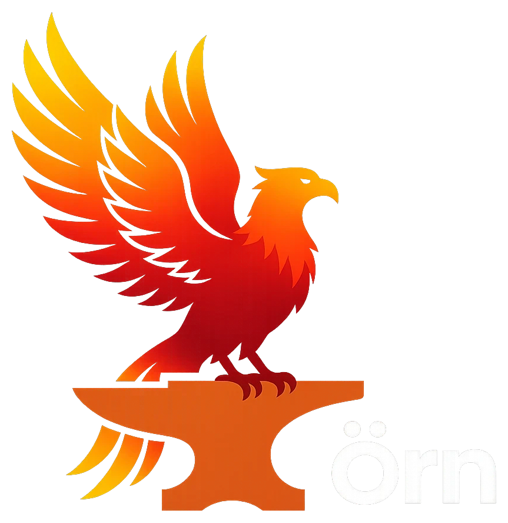

### Ben MacD
Building autonomous dev tooling and gamified developer experiences.

 

<!-- auto-refreshed daily by .github/workflows/update-profile-art.yml -->

 
 

<table>
<tr>
<td align="center" width="50%">

 <b>Örn's Forge</b>
 autonomous dev plugin for Claude Code
</td>
<td align="center" width="50%">

 <b>devmon</b>
 gamified terminal creature-collection RPG
</td>
</tr>
</table>

 

**Stack:** Python · Claude Code / Agent SDK · GitHub Actions · self-hosted infra
