### Ben MacD
Building autonomous dev tooling and gamified developer experiences.

 

<!-- auto-refreshed daily by .github/workflows/update-profile-art.yml -->

 
 

<!-- regenerate: python scripts/prep_photo.py <photo> && python scripts/make_portrait_svg.py -->

 

**Building:** [Örn's Forge](https://github.com/BenMacDeezy/Orns-Forge) — autonomous development plugin for Claude Code
**Also:** [devmon](https://github.com/BenMacDeezy/devmon) — gamified terminal creature-collection RPG

**Stack:** Python · Claude Code / Agent SDK · GitHub Actions · self-hosted infra
